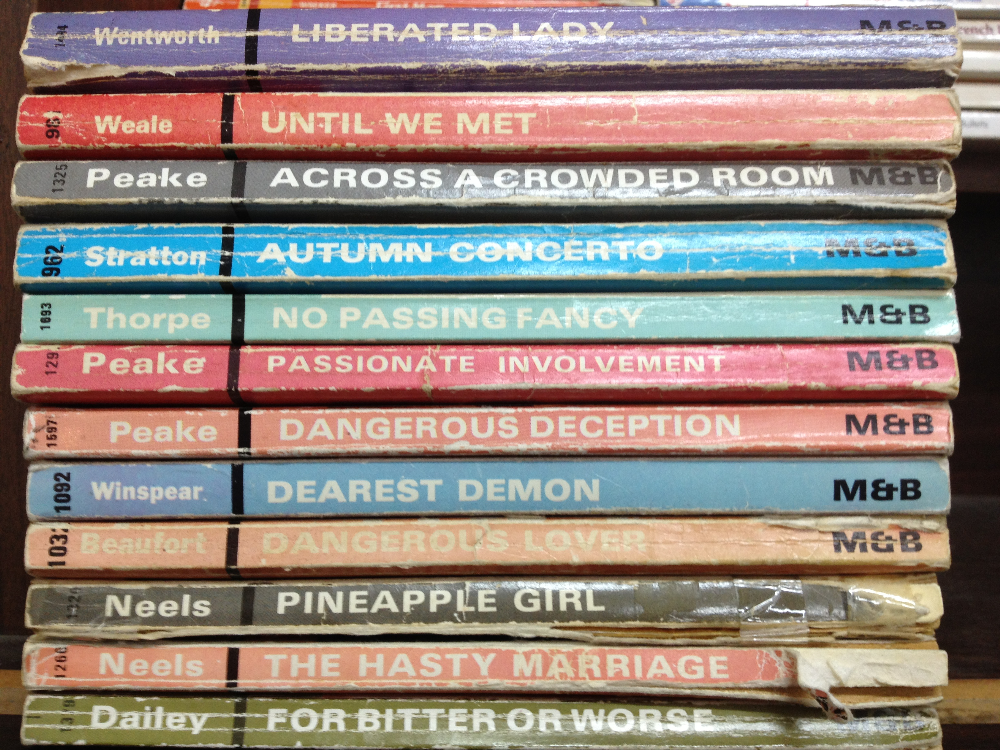

# Github learning session

## some text decoration test stuff
**Bold**, *italics*, ~strikethroughs~

__bold__ and _italics_ or ___bold italics___

 rule a line to end a section, use the minus sign eg 
 
 ## lists
 
### bullet point list
 
 * one
 * two
 * three
 
 or you can use a dash
 - one
 - two
 - three
 
### numbered list
 
 1. one
 1. two
 1. three
 
### checked lists

ToDos and Dones
 - [ ] item one
 - [ ] item two
 - [x] item three
 
 ### nesting lists
 
 * item one
   * Sub-item one
 * item two
   * Sub-item one
   * Sub-item two
   
 ## tables
 
 | Name | Age | Department | Job|
 |---|---|---|---|
 |Riku|25|biochemistry|ARF|
 |Sarah|46|DSM|social media advisor|
 |Mik|40|biochemistry|stats guy|
 
 | Name | Address | Street | Year| Image |
 |---|---|---|---|---|
 |*The Libra Flat* | 113 | Harbour Terrace|2014||
 |*Beehive*| 615 | Castle Street|2010|
 
 
 
 
 
 ## Mark down paragraphs, text, and quotes
 
 So this sentence contains only a single whitespace in between the words.
 
 But this sentence   contains many a single   whitespace in between    the words.
  

 create a paragraph by having a white line between, eg
 
 Video provides a powerful way to help you prove your point. When you click Online Video, you can paste in the embed code for the video you want to add. You can also type a keyword to search online for the video that best fits your document. To make your document look professionally produced, Word provides header, footer, cover page, and text box designs that complement each other. For example, you can add a matching cover page, header, and sidebar. 
 
Click Insert and then choose the elements you want from the different galleries. Themes and styles also help keep your document coordinated. When you click Design and choose a new Theme, the pictures, charts, and SmartArt graphics change to match your new theme. When you apply styles, your headings change to match the new theme. Save time in Word with new buttons that show up where you need them.

This is how you write quotes:

> "You're a wizard, Harry."

This is a longer quote

> "Click Insert and then choose the elements you want from the different galleries. Themes and styles also help keep your document coordinated. When you click Design and choose a new Theme, the pictures, charts, and SmartArt graphics change to match your new theme. When you apply styles, your headings change to match the new theme. Save time in Word with new buttons that show up where you need them."


## codes and syntax highlighting

you can insert codes inline with a pair of `backticks`.

**DON'T RUN THIS CODE**
```bash
echo hello world
cd /
```


## Links/hyperlinks

[]()

square bracket is the linked text round bracket is the URL

This is a link to [Dunedin Flat Names Project](http://www.dunedinflatnames.co.nz)


## inserting images

first upload an image into project


smaller version


from the web


 ----------------------------------------
 
